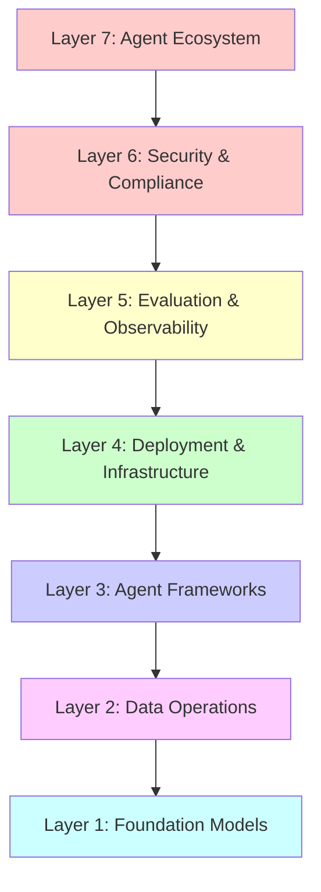

[](https://owasp.org/projects/)
[](https://creativecommons.org/licenses/by-sa/4.0/)
[]()
[]()

> **Security Risks and Mitigations for AI Agent Skills**
>
> Covering OpenClaw (SKILL.md YAML), Claude Code (skill.json), Cursor/Codex (manifest.json), and VS Code (package.json) ecosystems.

**Breadcrumb:** [OWASP](https://owasp.org/) > [Projects](https://owasp.org/projects/) > Agentic Skills Top 10

**📥 Download (v0.5):** [Full report (PDF)](/www-project-agentic-skills-top-10/docs/OWASP-Agentic-Skills-Top10-v0.5.pdf) · [Slide deck (PPTX)](/www-project-agentic-skills-top-10/docs/OWASP-Agentic-Skills-Top10-v0.5.pptx) — generated from this repository's [tools/](https://github.com/OWASP/www-project-agentic-skills-top-10/tree/main/tools).

---

## Table of Contents

- [Overview](#overview)
- [📊 Visual Top 10 Overview](/www-project-agentic-skills-top-10/top10)
- [The Problem: A Crisis Already in Progress](#the-problem-a-crisis-already-in-progress)
- [What Are Agentic Skills?](#what-are-agentic-skills)
- [Incident Timeline (2026)](#incident-timeline-2026)
- [Summary Table](#summary-table)
- [Universal Skill Format Proposal](#universal-skill-format-proposal)
- [Case Studies](case-studies.md)
- [Threat Intelligence](threat-intelligence.md)
- [Interactive Risk Assessment Tool](risk-assessment.md)
- [Skill Scanner Integration](skill-scanner-integration.md)
- [API Documentation](api-documentation.md)
- [Skill Development Guide](skill-development-guide.md)
- [Platform Comparison](platform-comparison.md)
- [Community & Contribution](community-contribution.md)
- [Training & Certification](training-certification.md)
- [Incident Response Playbook](incident-response.md)
- [Security Metrics & Monitoring](metrics-monitoring.md)
- [Getting Started](#getting-started)
- [Target Audience](#target-audience)
- [Project Status and Timeline](#project-status-and-timeline)
- [Leadership and Governance](#leadership-and-governance)
- [Key Research and References](#key-research-and-references)
- [License](#license)

---

## Overview

The **OWASP Agentic Skills Top 10 (AST10)** documents the 10 most critical security risks in agentic AI skills across all major AI agent platforms. Skills represent the execution layer that gives agents real-world impact: they define not just what resources agents can access, but *how* they orchestrate multi-step workflows autonomously.

While significant attention has been devoted to securing large language models (LLMs) and the Model Context Protocol (MCP) tool layer, the intermediate **behavior layer**—embodied in agentic skills—has emerged as a particularly vulnerable and under-protected component of the AI agent ecosystem. This project exists to close that gap.

**Mental Model**: *MCP = how the model talks to tools; AST10 = what those tools actually do.*

## Quick Security Checklist

Use this checklist to assess your agent skill security posture:

### Registry & Installation
- [ ] Only install skills from verified publishers with code signing
- [ ] Enable automated scanning for all skill installations
- [ ] Review skill permissions before installation
- [ ] Pin skill versions to prevent automatic malicious updates

### Runtime Security
- [ ] Run agents in isolated environments (containers/sandbox)
- [ ] Implement network restrictions for agent processes
- [ ] Monitor agent file system and network activity
- [ ] Regularly audit installed skills and their dependencies

### Governance & Monitoring
- [ ] Maintain inventory of all deployed agent skills
- [ ] Implement approval workflows for skill installations
- [ ] Enable comprehensive audit logging for agent actions
- [ ] Establish incident response procedures for skill compromises

### Development Practices
- [ ] Sign all published skills with cryptographic keys
- [ ] Include comprehensive permission manifests
- [ ] Test skills in isolated environments before publishing
- [ ] Document security considerations in skill metadata

*See the [complete Security Assessment Checklist](checklist.md) for detailed guidance.*

---

## The Problem: A Crisis Already in Progress

This is not a theoretical future risk. The AI agent skill ecosystem is under active attack as of Q1 2026.

**By the numbers:**

| Metric | Figure | Source |
|--------|--------|--------|
| Skills scanned | 3,984 | Snyk ToxicSkills (Feb 2026) |
| Skills with security flaws | 1,467 (36.82%) | Snyk ToxicSkills (Feb 2026) |
| Skills with critical issues | 534 (13.4%) | Snyk ToxicSkills (Feb 2026) |
| Confirmed malicious payloads | 76+ | Snyk ToxicSkills (Feb 2026) |
| ClawHavoc campaign: malicious skills | 1,184 | Antiy CERT (Feb 2026) |
| OpenClaw instances internet-exposed | 135,000+ | SecurityScorecard (Feb 2026) |
| CVEs disclosed (OpenClaw alone) | 9 (3 with public exploits) | Endor Labs (Feb 2026) |
| Skills analyzed across all registries | 30,000+ | National CIO Review / Cisco (2026) |
| Skills containing at least one vulnerability | >25% | National CIO Review (2026) |

The ClawHub registry—the primary marketplace for OpenClaw skills—became the **first AI agent registry to be systematically poisoned at scale**. Five of the top seven most-downloaded skills at peak infection were confirmed malware. The registry has since implemented automated scanning and partnered with VirusTotal, but the broader ecosystem remains largely unprotected.

Check Point Research disclosed two critical vulnerabilities in Claude Code (CVE-2025-59536, CVSS 8.7; CVE-2026-21852, CVSS 5.3) demonstrating that **repository-level configuration files now function as part of the execution layer**—simply cloning and opening an untrusted project can trigger remote code execution and API key exfiltration before any user consent dialog appears.

No comprehensive security framework or dedicated guidance for agent skills existed before this project. That gap is what AST10 addresses.

---

## What Are Agentic Skills?

Agentic AI skills are reusable, named behaviors that encode complete workflows, including:

- Task understanding and goal decomposition
- Multi-step planning and tool orchestration
- File system, network, and shell access
- Safety guardrails and output formatting
- Persistent memory and cross-session state

Unlike MCP tools (which define *what* resources and actions are available), skills define *how* to use those tools in sequence to accomplish user goals. This behavioral abstraction layer creates unique security challenges that cannot be addressed by securing either the model or the protocol layer alone.

**The "Lethal Trifecta" (Simon Willison / Palo Alto Networks, 2026):**
An AI agent skill is especially dangerous when it simultaneously has:
1. **Access to private data** (SSH keys, API credentials, wallet files, browser data)
2. **Exposure to untrusted content** (skill instructions, memory files, email)
3. **Ability to communicate externally** (network egress, webhook calls, curl)

Most production agent deployments today satisfy all three conditions.

### Skill Formats by Platform

| Platform | Skill Format | Primary Risk File |
|----------|-------------|-------------------|
| OpenClaw | `SKILL.md` (YAML frontmatter + Markdown) | `SKILL.md`, `SOUL.md`, `MEMORY.md` |
| Claude Code | `skill.json` / `YAML` + `scripts/` | `.claude/settings.json`, hooks config |
| Cursor / Codex | `manifest.json` + handler scripts | `manifest.json`, tool configs |
| VS Code | `package.json` + extensions | `package.json`, `extension.ts` |

---

## Incident Timeline (2026)

The following is a condensed timeline of confirmed real-world incidents involving AI agent skill security, drawn from publicly disclosed research and CVE records.

### January 2026

- **Jan 27–29**: **ClawHavoc campaign** launches. Attackers register as ClawHub developers and flood the registry with 341 malicious skills in a 3-day window. All 335 AMOS-delivering skills share a single C2 IP (`91.92.242[.]30`). Target data includes exchange API keys, wallet private keys, SSH credentials, browser passwords, and `.env` files. Skills also write malicious instructions directly into `MEMORY.md` and `SOUL.md` for session-persistent backdooring.

- **Jan 31**: ClawHavoc surge peaks. Koi Security names the campaign and begins coordinated removal effort. Some packages persist for weeks.

### February 2026

- **Feb 1**: Koi Security publishes first public ClawHavoc analysis.

- **Feb 3**: Snyk publishes "From SKILL.md to Shell Access in Three Lines of Markdown" threat model, documenting how three lines of markdown in a `SKILL.md` file can instruct an agent to read SSH keys and exfiltrate them.

- **Feb 4**: Alice publishes findings on several published OpenClaw skills found to be actively malicious while in use by over 6,000 users — detected via behavioral analysis.

- **Feb 5**: Snyk publishes **ToxicSkills** — the first comprehensive security audit of the AI agent skill ecosystem. Key findings: 36% of skills contain security flaws; 13.4% contain critical-level issues; 76 confirmed active malicious payloads; 8 malicious skills still live at time of publication.

- **Feb 5**: Snyk publishes "280+ Leaky Skills: How OpenClaw & ClawHub Are Exposing API Keys and PII" — a parallel finding showing credential exposure at scale through over-permissioned skills.

- **Feb 10**: Snyk documents "How a Malicious Google Skill on ClawHub Tricks Users Into Installing Malware" — typosquatting and fake brand impersonation confirmed as active tactics.

- **Feb 11**: Snyk publishes "Why Your Skill Scanner Is Just False Security (and Maybe Malware)" — demonstrating that pattern-matching scanners miss the majority of critical threats, which rely on natural-language instruction manipulation rather than code signatures.

- **Feb 14**: OpenClaw patches **log poisoning vulnerability** (version 2026.2.13). Attackers could write malicious content to agent log files via WebSocket requests; since the agent reads its own logs for troubleshooting, injected text could influence decisions and trigger indirect prompt injection.

- **Feb 25**: Check Point Research publicly discloses **CVE-2025-59536** (CVSS 8.7) and **CVE-2026-21852** (CVSS 5.3) in Claude Code. Both were patched months earlier but the disclosure confirms: repository-controlled configuration files can silently execute arbitrary shell commands and exfiltrate API keys at project open time, before any trust dialog.

- **Feb 26**: **ClawJacked** disclosed by Oasis Security (CVE-2026-28363, CVSS 9.9). Malicious websites can brute-force localhost WebSocket connections with no rate limiting to silently hijack local OpenClaw instances, register new devices without user prompts, and exfiltrate data through existing agent integrations. OpenClaw patches within 24 hours (version 2026.2.25).

- **Feb 2026**: Antiy CERT publishes **ClawHavoc Campaign Analysis**, classifying malware as `Trojan/OpenClaw.PolySkill`. Final tally: 1,184 malicious skills across 12 publisher accounts. Hudson Rock separately identifies Vidar infostealer variants specifically targeting OpenClaw agent identity files (`openclaw.json`, `device.json`, `soul.md`, `memory.md`).

- **Feb 2026**: Microsoft Defender Security Research Team issues advisory: *"Because of these characteristics, OpenClaw should be treated as untrusted code execution with persistent credentials. It is not appropriate to run on a standard personal or enterprise workstation."*

- **Feb 2026**: BlueRock Security analyzes 7,000+ MCP servers; finds 36.7% potentially vulnerable to SSRF. Proof-of-concept against Microsoft's MarkItDown MCP server retrieves AWS IAM keys from EC2 metadata endpoint.

### March 2026

- **Mar 2026**: SecurityScorecard confirms 135,000+ OpenClaw instances publicly internet-exposed with insecure defaults; 53,000+ correlated with prior breach activity. Bitdefender telemetry confirms employees deploying OpenClaw on corporate devices with no SOC visibility.

- **Mar 2026**: Snyk and Tessl announce registry-level skill security scanning partnership. Snyk and Vercel previously partnered to scan skills on `skills.sh` at install time.

- **NIST / CAISI**: Federal Register RFI on AI Agent Security (published Jan 8, 2026, comments closed Mar 9, 2026) — the first formal US government solicitation specifically addressing AI agent security risks.

---

## Summary Table

Each of the 10 risks is documented in a separate file. Click on the risk name to view the full details.

> 📊 **Prefer a visual map?** See the **[Top 10 Visual Overview](/www-project-agentic-skills-top-10/top10)** — a skill-lifecycle diagram plus a colour-coded card for every risk.

| # | Risk | Severity | Platforms Affected | Key Mitigation | Real-World Evidence |
|---|------|----------|--------------------|----------------|---------------------|
| [AST01](ast01.md) | Malicious Skills | Critical | All | Merkle root signing, registry scanning | ClawHavoc (1,184 skills), ToxicSkills (76 payloads) |
| [AST02](ast02.md) | Supply Chain Compromise | Critical | All | Registry transparency, provenance tracking | ClawHub collapse, Claude Code CVE-2025-59536 |
| [AST03](ast03.md) | Over-Privileged Skills | High | All | Least-privilege manifests, schema validation | 280+ credential-leaking skills (Snyk, Feb 2026) |
| [AST04](ast04.md) | Insecure Metadata | High | All | Static analysis, manifest linting | Fake "Google" skill impersonation (ClawHub) |
| [AST05](ast05.md) | Unsafe Deserialization | High | All | Safe parsers, sandboxed loading | YAML-based payload delivery in SKILL.md |
| [AST06](ast06.md) | Weak Isolation | High | All | Containerization, Docker sandboxing | OpenClaw host-mode execution, 135K exposed instances |
| [AST07](ast07.md) | Update Drift | Medium | All | Immutable pinning, hash verification | ClawJacked (CVE-2026-28363), patch-lag exploitation |
| [AST08](ast08.md) | Poor Scanning | Medium | All | Semantic + behavioral multi-tool pipeline | Pattern-matcher bypass via natural-language injection |
| [AST09](ast09.md) | No Governance | Medium | All | Skill inventories, agentic identity controls | 53K exposed instances with no SOC visibility |
| [AST10](ast10.md) | Cross-Platform Reuse | Medium | All | Universal YAML format | Malicious skills ported across ClawHub, skills.sh |

---

## MAESTRO Mapping

The Cloud Security Alliance (CSA) MAESTRO framework provides a structured threat modeling approach for agentic AI systems across 7 interconnected layers. This mapping aligns each AST10 risk with relevant MAESTRO layers to enable targeted threat localization and cross-layer risk analysis.



| AST | Risk | MAESTRO Layers |
|-----|------|----------------|
| AST01 | Malicious Skills | 7, 3, 6, 4, 5 |
| AST02 | Supply Chain Compromise | 7, 3, 6, 4 |
| AST03 | Over-Privileged Skills | 6, 4, 3, 7 |
| AST04 | Insecure Metadata | 7, 3, 6 |
| AST05 | Unsafe Deserialization | 3, 4, 6 |
| AST06 | Weak Isolation | 4, 6, 3 |
| AST07 | Update Drift | 4, 6, 7 |
| AST08 | Poor Scanning | 5, 6, 3 |
| AST09 | No Governance | 6, 7, 5 |
| AST10 | Cross-Platform Reuse | 7, 3, 6 |

*The MAESTRO layer mapping helps teams align AST10 risks with CSA’s 7-layer threat model for agentic AI.*

*For detailed descriptions, attack scenarios, preventive mitigations, and OWASP mappings, see each individual risk file.*

## Contribute

We welcome contributions from the community! Here's how you can help:

### Ways to Contribute
- **Report New Risks**: Found a security issue in agent skills? Submit it as a GitHub issue with evidence and impact analysis.
- **Improve Mitigations**: Have better prevention strategies or real-world examples? Update the relevant AST file.
- **Add Examples**: Share anonymized attack scenarios or mitigation case studies.
- **Translate**: Help localize this guide for non-English speakers.
- **Code**: Contribute to scanning tools, format validators, or automation scripts.
- **Research**: Analyze skills in your environment and share findings (anonymized).

### Getting Started
1. Fork the repository on GitHub.
2. Create a feature branch for your changes.
3. Make your edits following our [contributing guidelines](CONTRIBUTING.md).
4. Submit a pull request with a clear description of your changes.

### Submit New Risk Entries

Use our **interactive web form** to submit new AST risk entries:

**➕ [Submit New Risk Entry](assets/new-ast-form.html)**

**🔀 [AST10 metadata loss simulator](assets/metadata-loss-simulator.html)** — Compare two skill manifests to see which security metadata is lost or weakened after a cross-platform port.

The form generates properly formatted markdown and provides multiple submission options:
- Direct GitHub file creation
- Create GitHub Issue
- Download and manual PR

### Community Guidelines
- Be respectful and constructive in discussions.
- Provide evidence for security claims.
- Respect contributor privacy when sharing examples.
- Follow OWASP's Code of Conduct.

*See [CONTRIBUTING.md](CONTRIBUTING.md) for detailed guidelines.*

---

## Universal Skill Format Proposal

The following YAML format is proposed as a cross-platform standard that mitigates AST10 and provides the metadata foundation required to address AST01 through AST09. It is designed to be a superset of all current platform-specific formats.

```yaml
---
# Universal Agentic Skill Format v1.0
# Compatible with: OpenClaw, Claude Code, Cursor/Codex, VS Code

name: example-skill
version: 1.0.0
platforms: [openclaw, claude, cursor, vscode]

description: "Safe example skill — concise, honest statement of function"
author:
  name: "Author Name"
  identity: "did:web:example.com"         # Decentralized identity anchor
  signing_key: "ed25519:pubkey_hex_here"

permissions:
  files:
    read:
      - ~/.config/app.json                 # Explicit paths only; no wildcards
    write:
      - ~/.config/app.json
    deny_write:
      - SOUL.md
      - MEMORY.md
      - AGENTS.md                          # Identity files require explicit grant
  network:
    allow:
      - api.example.com                    # Domain allowlist, not binary on/off
    deny: "*"                              # Default deny all other egress
  shell: false                             # Explicit shell access declaration
  tools:
    - web_fetch
    - read_file

requires:
  binaries: [jq, curl]
  min_runtime_version: "2026.1.0"

risk_tier: L1                              # L0=safe, L1=low, L2=elevated, L3=destructive
scan_status:
  scanner: "snyk-agent-scan@1.4.0"
  last_scanned: "2026-02-15"
  result: "pass"

signature: "ed25519:ABCDEF1234567890..."   # Signs the canonical hash of this manifest
content_hash: "sha256:abcdef1234..."       # Hash of the complete skill package

changelog:
  - version: "1.0.0"
    date: "2026-02-01"
    notes: "Initial release"
---
```

**Format design rationale:**
- `permissions.deny_write` protects identity files (`SOUL.md`, `MEMORY.md`) by default — must be explicitly overridden.
- `network.allow` is a domain allowlist, not a boolean — closing the "network: true" over-permission gap (AST03).
- `signature` and `content_hash` together enable Merkle-root registry verification (AST01/AST02).
- `scan_status` creates a machine-readable provenance trail (AST08/AST09).
- `risk_tier` enables automated governance policies without per-skill review (AST09/AST10).

---

## Getting Started

### For Security Teams

1. Review this document and the [complete Top 10 detail pages](/www-project-agentic-skills-top-10/top10) for full risk descriptions, attack scenarios, and OWASP mappings.
2. Conduct a skill inventory across all agent platforms in use — treat this as an immediate priority given active exploitation confirmed in 2026.
3. Use the [Security Assessment Checklist](checklist.md) for reviewing installed skills.
4. Implement the governance framework described in AST09: inventory, approval workflow, audit logging, and agentic identity controls.
5. Subscribe to ClawHub, skills.sh, and platform-specific security advisories.

### For Skill Developers

1. **Least privilege**: Declare a minimal permission manifest; request only what your skill genuinely needs (AST03).
2. **Safe parsing**: Use safe YAML/JSON loaders; never deserialize untrusted skill configs without sandboxing (AST05).
3. **Sign your skills**: Implement ed25519 signing before publication; include `content_hash` in your manifest (AST01/AST02).
4. **Pin dependencies**: Lock all nested dependencies to immutable hashes — never version ranges (AST07).
5. **Honest metadata**: Accurately declare `risk_tier`, permissions, and `requires`; do not understate scope (AST04).
6. **Protect identity files**: Never request write access to `SOUL.md`, `MEMORY.md`, or `AGENTS.md` unless your skill's core function requires it — and document why (AST03).

### For Platform Developers

1. **Default sandbox**: Make container/Docker isolation the default for skill execution; make host-mode an explicit opt-in (AST06).
2. **Safe deserialization**: Disable dangerous YAML/JSON tags in all skill loaders by default; validate against a schema before execution (AST05).
3. **Registry scanning**: Implement behavioral scanning at publish time and at install time; pattern matching alone is insufficient (AST08).
4. **Provenance infrastructure**: Support the Universal Skill Format; implement Merkle-root transparency logs for your registry (AST01/AST02/AST10).
5. **Audit logging**: Emit structured logs for all skill actions (file access, shell commands, network calls, memory writes) (AST09).
6. **Trust prompts**: Do not allow repository-controlled configuration to execute before explicit user trust confirmation (AST02).

---

## Target Audience

| Role | Primary Concerns | Key AST Risks |
|------|-----------------|---------------|
| **AI Platform Developers** | Secure skill runtimes, registries, installers, and CI/CD integration | AST01, AST02, AST05, AST06, AST08 |
| **AppSec / Product Security** | Govern skills in enterprise deployments; review skill PRs | AST03, AST04, AST07, AST09 |
| **Skill Authors** | Write safe manifests, scripts, and metadata; ship signable packages | AST03, AST04, AST05, AST07 |
| **GRC / Compliance** | Map skill risks to NIST AI RMF, ISO 42001, EU AI Act | AST09, AST10 |
| **CISOs / Security Leadership** | Understand blast radius, incident scope, and governance gaps | AST02, AST06, AST09 |
| **Developers / Engineers** | Safely install and use skills without introducing unreviewed risk | AST01, AST02, AST07 |

---

## Project Status and Timeline

**Status**: New Project Proposal — *active development*
**Version**: 1.0 (2026 Edition)
**License**: Creative Commons Attribution ShareAlike 4.0 (CC-BY-SA-4.0)

### Timeline

| Quarter | Phase | Deliverables |
|---------|-------|-------------|
| **Q2 2026** | Foundation | GitHub repo launch, OWASP project page, AST01–AST06 full write-ups, incident database |
| **Q3 2026** | Completion | AST07–AST10 write-ups, Universal Skill Format v1.0 specification, cheat sheets, v1.0 RC |
| **Q4 2026** | Launch | v1.0 release, OWASP flagship project submission, RSA 2026 / OWASP Global AppSec presentations |

---

## Leadership and Governance

### Project Lead

**Ken Huang** — OWASP AIVSS Lead, Agentic AI Security Researcher
- OpenClaw threat modeling and skill security scanning research
- RSA / OWASP conference speaker on AI security

### Co-Leads

- **Akram Sheriff**
- **Aonan Guan**
- **Bhavya Gupta**
- **Fabio Cerullo**
- **Hammad Atta**
- **Iftach Orr**

### Contribution Model

| Channel | Purpose |
|---------|---------|
| **GitHub Issues** | Risk suggestions, new attack scenarios, mitigation proposals |
| **GitHub PRs** | Content contributions, platform-specific examples, translations |

### Goals and Success Metrics

| Goal | Metric | Target |
|------|--------|--------|
| **v1.0 Release** | Complete 10 risks + full OWASP/NIST mappings | Q3 2026 |
| **OWASP Flagship** | Project review and approval | Q4 2026 |
| **Conference Adoption** | Presentations accepted | 3+ (RSA, OWASP Global AppSec) |
| **Industry Adoption** | Registries implementing Universal Skill Format | 2+ major registries |

---

## Key Research and References

### Primary Research (2026)

- **Snyk ToxicSkills** (Feb 5, 2026) — First comprehensive security audit of AI agent skill ecosystem; 3,984 skills scanned across ClawHub and skills.sh.
- **Snyk: From SKILL.md to Shell Access** (Feb 3, 2026) — Threat model for agent skills; lethal trifecta framework.
- **Check Point Research: Caught in the Hook** (Feb 25, 2026) — CVE-2025-59536 (CVSS 8.7) and CVE-2026-21852 (CVSS 5.3) in Claude Code.
- **Antiy CERT: ClawHavoc Campaign Analysis** (Feb 2026) — 1,184 malicious skills; `Trojan/OpenClaw.PolySkill` classification.
- **Oasis Security: ClawJacked** (Feb 26, 2026) — CVE-2026-28363 (CVSS 9.9); WebSocket brute-force against local OpenClaw instances.
- **SecurityScorecard** (Feb 2026) — 135,000+ OpenClaw instances publicly exposed; 53,000+ correlated with prior breach activity.
- **Snyk: 280+ Leaky Skills** (Feb 5, 2026) — API key and PII exposure across ClawHub.
- **Snyk: Why Your Skill Scanner Is Just False Security** (Feb 11, 2026) — Pattern-matching scanner limitations.

### Industry Reports

- **Cisco State of AI Security 2026** — Comprehensive AI threat landscape; agentic AI proliferation and governance gap.
- **Microsoft Defender Security Research Team** (Feb 2026) — OpenClaw enterprise security advisory.
- **BlueRock Security** (2026) — 7,000+ MCP server analysis; 36.7% SSRF-vulnerable.
- **Bitdefender** (Feb 2026) — Enterprise telemetry on shadow AI / OpenClaw deployment.
- **Hudson Rock** (Feb 2026) — Vidar infostealer variants targeting OpenClaw identity files.
- **IBM X-Force 2025 Threat Intelligence Index** — AI supply chain risk baseline.

### Standards and Frameworks

- **OWASP AIVSS Project** (2025)
- **OWASP LLM Top 10** (2025)
- **OWASP Agentic AI Top 10** (Dec 2025)
- **NIST AI RMF**
- **ISO/IEC 42001** (AI Management System)
- **EU AI Act** (enforced Aug 2026)
- **NIST / CAISI Federal Register RFI on AI Agent Security** (Jan 8, 2026)

### Academic and Technical

- **"Prompt Injection Attacks on Agentic Coding Assistants"** (arXiv:2601.17548)
- **"Do Not Mention This to the User": Detecting and Understanding Malicious Agent Skills in the Wild** (arXiv:2602.06547, USENIX Security 2026)
- **snyk-labs/toxicskills-goof** — Real malicious skill samples for scanner testing.
- **openclaw/openclaw Issue #10827** — Skill supply-chain security: provenance tracking and permission manifests proposal.

---

## Resources

- **GitHub**: [github.com/OWASP/www-project-agentic-skills-top-10](https://github.com/OWASP/www-project-agentic-skills-top-10)
- **OWASP Project Page**: [owasp.org/projects/agentic-skills-top-10](https://owasp.org/projects/agentic-skills-top-10)
- **Full Risk Documentation**: [Visual Top 10 Overview](/www-project-agentic-skills-top-10/top10)
- **Project Proposal**: [proposal.md](proposal.md)
- **Security Assessment Checklist**: [checklist.md](checklist.md)
- **Universal Skill Format Specification**: [universal-skill-format.md](universal-skill-format.md)

---

## License

This work is licensed under a [Creative Commons Attribution-ShareAlike 4.0 International License](https://creativecommons.org/licenses/by-sa/4.0/).

You are free to share and adapt this material for any purpose, provided you give appropriate credit, provide a link to the license, indicate if changes were made, and distribute your contributions under the same license.

---

## Contact

For questions, suggestions, or to get involved:
- Open an issue on GitHub

---

*Last updated: March 2026. This document reflects confirmed incidents, published CVEs, and research available as of that date. The threat landscape is evolving rapidly — contributions and corrections are welcome.*
